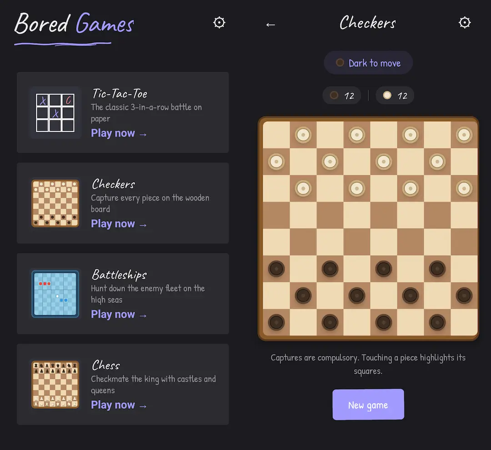

# Bored Games

A collection of classic board games you can play on your phone — either locally on a shared device or online against a friend over the internet.

https://digitallyrefined.github.io/bored-games or [download the app](https://github.com/DigitallyRefined/bored-games/releases)



## Games

Each game has two ways to play:

- **Local** — two players take turns on a single device.
- **Online** — create or join a room over the internet and play against a friend.

| Game | What it is |
| --- | --- |
| **Tic-Tac-Toe** | The classic 3-in-a-row battle. X goes first, O follows. |
| **Checkers** | Capture every piece on the board. Mandatory captures, promotions to kings, and draw rules included. |
| **Battleships** | Hunter-killer on the high seas. Place your five-ship fleet, then take turns firing at the enemy grid until one fleet is sunk. |
| **Chess** | Full rules: castling, en passant, pawn promotion, check, checkmate, stalemate, the fifty-move rule, and insufficient material. |

## How it works

Built as a small three-part project:

| Directory | What it is |
| --- | --- |
| `app/` | The mobile app, built with [Expo](https://expo.dev) (React Native). |
| `api/` | A small [Bun](https://bun.com) WebSocket server that powers online play. |
| `shared/` | Pure TypeScript implementations of the game rules, shared by the app and the API. |

### Game rules

The rules live as **pure TypeScript** in `shared/games/` (e.g. `chess.ts`, `battleships.ts`). They have no server or UI dependencies, so the same code validates a move and computes the next board state in both the app and the API — the server never trusts a move the client sends.

The API registers each game through a common `GameEngine` interface (`api/src/games/`) that handles turn order, move validation, applying moves, and detecting game-over. Battleships is built from a generic **settle-then-play** engine (`api/src/games/setup-game.ts`) that supports an initial private arranging phase (fleet placement, a card draw, dominoes, etc.) before alternating turns begin; future card and tile games can plug into the same factory.

### Local play

All rules run on-device using the shared code. Just hand the phone to a friend after each move.

### Online play

The app talks to the API over a WebSocket (`/ws`). The protocol is defined in `app/src/lib/protocol.ts`:

1. `auth` — the app generates a username (three random words, e.g. `mango-robin-zebra`) and a shared-secret token, and the server records the user.
2. `create_room` / `join_room` — one player creates a room and gets a three-word room code (e.g. `mango-robin-zebra`) to share. Joining requires both the code and the same game type. When the room fills, the server starts the game and broadcasts the initial state.
3. `move` — a player sends a move; the server validates it against the shared engine, applies it, stores it, and broadcasts the new state (`opponent_move`) or `game_over` to everyone in the room.
4. Players disconnect via `leave_room`/socket close; the server cleans up waiting rooms and notifies the remaining player when an opponent drops.

State is kept in an ephemeral in-memory SQLite database: users, rooms, players, and every move. Nothing survives a restart, and the API runs as a single instance.

## Setup

### 1. The app

```bash
cd app
npm install
npx expo start
```

Use the Expo output to run the app on a simulator, emulator, Expo Go, or a physical device. Local play needs nothing else.

For **online play** the app must reach the API:

- On an iOS simulator or web, `localhost` works out of the box.
- On an Android emulator, the app defaults to `10.0.2.2` (the host machine).
- On a physical device, either add a `.env` in `app/` with your machine's LAN address, e.g.:
  ```bash
  EXPO_PUBLIC_WS_URL=ws://192.168.1.10:3001/ws
  ```
  or set the WebSocket server address in the app's **Settings** screen after launching.

### 2. The API (for online play)

The server requires only [Bun](https://bun.com).

```bash
cd api
bun install

# Start the server
bun run dev        # development (hot reload), or:
bun run start      # production
```

The server listens on `ws://localhost:3001/ws` (override with `PORT`).

### 3. Deploying the API to [Render](https://render.com)

A `Dockerfile` at the repo root builds the API for production. It uses the **whole repo as the build context**, so `api/` can resolve the `@shared/*` imports from `shared/`. The image runs `bun run index.ts` from `/app/api`.

```bash
# Push the repo to GitHub
git remote add origin git@github.com:<you>/bored-games.git
git push -u origin main
```

1. **Create the API service.** In the Render dashboard, **New + → Web Service → Build and deploy from a Git repository** and select `bored-games`. Leave **Root Directory empty** — with a root directory set, Render only sends that folder to the Docker build, which would break the `../shared` imports. Render auto-detects the root `Dockerfile` (runtime **Docker**) and starts the container. Push-to-deploy is automatic. No database is needed — the API uses an in-memory SQLite database, so run it as a **single instance** (state resets on every deploy).
2. **Set a shared auth secret.** In the Web Service's **Environment** tab, add `AUTH_SECRET` with a random value. The app must sign tokens with the same secret — set that value as `EXPO_PUBLIC_AUTH_SECRET` in the app build. If you leave both unset, they fall back to the same development default (`bored-games-shared-secret`).
3. **Expose it publicly.** In the Web Service's **Settings → Domains**, confirm the generated URL, e.g. `https://bored-games-api.onrender.com`.
4. **Point the app at it.** In `app/.env`:
   ```bash
   EXPO_PUBLIC_WS_URL=wss://bored-games-api.onrender.com/ws
   EXPO_PUBLIC_AUTH_SECRET=<same value as AUTH_SECRET>
   ```
   (or enter the address in the app's **Settings** screen instead). Rebuild and run the app; online play now goes through Render.

If you prefer config-as-code, you can commit a `render.yaml` blueprint to the repo root and use **New + → Blueprint** instead:

```yaml
services:
  - type: web
    name: bored-games-api
    runtime: docker
    repo: https://github.com/<you>/bored-games
    plan: free
    healthCheckPath: /health
    envVars:
      - key: AUTH_SECRET
        generateValue: true
```

## Build the Android APKs (Docker)

Debug and release APKs are built with Gradle inside Docker using
[`build-android.sh`](./build-android.sh) and [`Dockerfile.android`](./Dockerfile.android).
Docker is the only host requirement — no Node, JDK, or Android SDK install is
needed. The first run builds the image and downloads Gradle dependencies, which
takes a while; later runs reuse the cached image and the local caches in
`.cache/` (git-ignored).

### Debug APK (default)

```sh
./build-android.sh
```

The debug APK is written to `build/apk/app-debug.apk`.

### Signed release APK

Create a release keystore with `keytool` (available from any JDK, for example via
the build image). Keep it safe — if you lose it you cannot update an
already-installed app.

```sh
mkdir -p android/keystores

keytool \
  -genkey -v \
  -storetype JKS \
  -keyalg RSA \
  -keysize 2048 \
  -validity 10000 \
  -storepass "$KEYSTORE_PASSWORD" \
  -keypass "$KEY_PASSWORD" \
  -alias "$KEY_ALIAS" \
  -keystore android.keystore \
  -dname "CN=DigitallyRefined,OU=,O=,L=,S=,C=US"
```

Store the credentials in an untracked `keystore.properties`:

```properties keystore.properties
storeFile=android.keystore
storePassword=YOUR_KEYSTORE_PASSWORD
keyAlias=YOUR_KEY_ALIAS
keyPassword=YOUR_KEY_PASSWORD
```

Then build with the release flag:

```sh
./build-android.sh --release \
  --keystore android.keystore \
  --properties keystore.properties
```

The signed APK is written to `build/apk/app-release.apk`. After a successful
release build the script verifies the APK and prints its signing information
(signing schemes, certificate DN and digests, key algorithm/size).

The `storeFile` value in your properties file is ignored: the script mounts the
keystore into the container and rewrites `storeFile` to its path inside the
container. Since `expo prebuild` regenerates the git-ignored `android/` directory
(and wipes manual Gradle edits), the script also runs
[`scripts/patch-release-signing.js`](./scripts/patch-release-signing.js) to point
the release build type at your keystore.

### Options

- `--clean` — regenerate the native `android/` project before building. Use this
  after changing native configuration (`app.json`, config plugins, native
  dependencies).
- `-h`, `--help` — show usage.

Do **not** commit `keystore.properties` or the keystore. The repo already ignores
`*.jks` and `/android`.

### Install

With `adb` on your `PATH` and a device connected over USB debugging:

```sh
adb install -r build/apk/app-release.apk
```

Or copy the APK to the device and open it to install. To update an already-installed
build, the APK must be signed with the same keystore.

## 🤖 AI generated code disclaimer

Some of the code in this repository may be generated with the assistance of AI tools. All changes are reviewed and tested on a real device with a human in the loop before being released.

## License

[MIT](LICENSE)